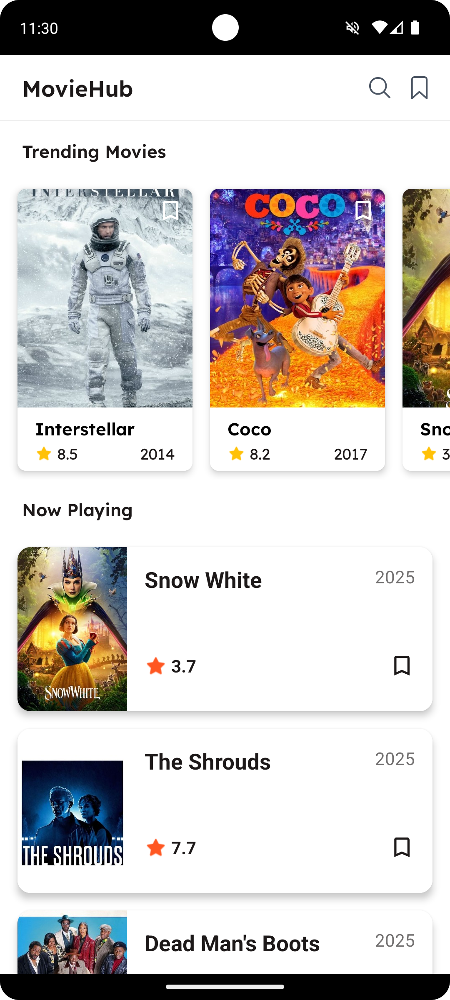
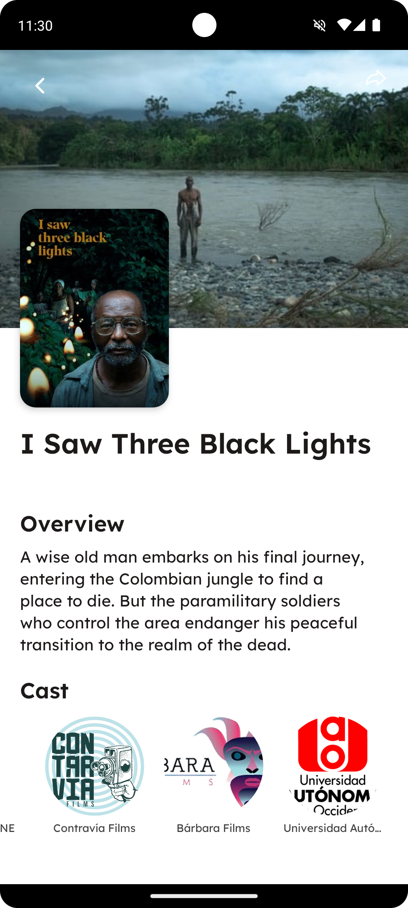

# MovieHub

MovieHub is an Android application built using Kotlin that showcases trending and now-playing movies using the [TMDB API](https://developers.themoviedb.org/3/getting-started/introduction). Users can explore movie details, bookmark their favorite movies, search for specific titles, and share movie links using deep links.

## Features
- Display Trending and Now Playing movies
- View detailed information about movies
- Bookmark movies to access them later
- Offline support using Room Database
- Search movies with real-time suggestions
- Share movies using deep links

## Screenshots
Here are some screenshots of the app:

<div align="center">
  <div style="display: flex; flex-direction: row; justify-content: space-between;">
    
    
  </div>
</div>

## Prerequisites
Before running the application, ensure you have the following:
- Android Studio (Latest version recommended)
- Android device or emulator

### API Key Setup
1. Sign up on [TMDB](https://www.themoviedb.org/) and get your API key.
2. Add the following to your `local.properties` file:
   
    ```properties
    API_KEY=your_tmdb_api_key
    ```

## Installation
1. Clone the repository:
    ```bash
    git clone https://github.com/yourusername/MovieHub.git
    ```
2. Open the project in **Android Studio**.
3. Sync Gradle files.
4. Ensure your `local.properties` file contains the API key.
5. Run the app on an emulator or device.

## Deep Link Testing
You can test the deep link functionality using the following ADB command:
```bash
adb shell am start -a android.intent.action.VIEW -d "moviehub://movie/movieId={movieId}" com.sgupta.moviehub
```
Replace `{movieId}` with the actual movie ID you want to navigate to.

## Contribution
Feel free to fork this repository and contribute by submitting pull requests.

## Additional Notes
- Make sure to have a stable internet connection for API calls.
- Offline support is enabled using Room Database.
- Deep linking enables users to directly navigate to the movie details screen from shared links.

Enjoy exploring movies with MovieHub!
